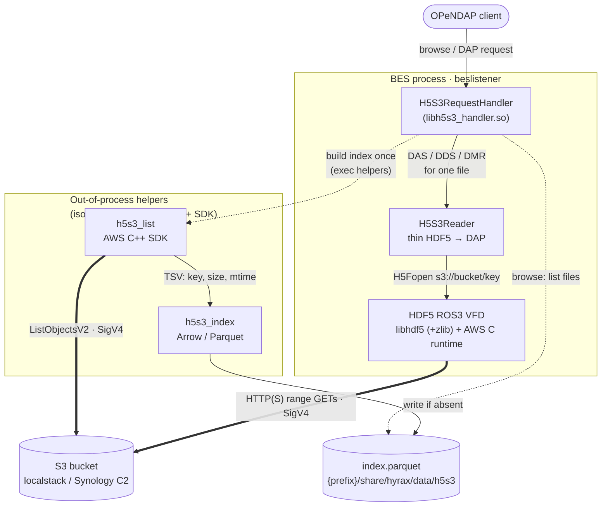

# h5s3_handler

A BES module that serves HDF5 files stored in **S3** through the HDF5
**ROS3** virtual file driver, with the bucket's file list cached as an Apache
**Parquet** index (`index.parquet`). Built to the specification in `claude.md`.

## Architecture



**Legend:** solid arrows = in-process calls; dashed = index orchestration / lookup;
thick = network I/O to S3. The two **out-of-process helpers** exist because the
Arrow/Parquet stack and the AWS C++ SDK each bundle an incompatible AWS SDK and
cannot share one process (see the note below). The BES module itself links only
the ROS3 HDF5, and reaches S3 *only* through the ROS3 VFD for data/metadata.

## What was built

| claude.md step | Status |
|---|---|
| 1. Create `h5s3` bucket, upload small HDF5 samples (awslocal) | ✅ done (12 files) |
| 2. New BES module `bes/modules/h5s3_handler` | ✅ sources + build wiring |
| 3. Uses `{prefix}/etc/bes/modules/h5s3.conf` | ✅ `h5s3.conf.in` |
| 4. Authenticate + list HDF5 files from S3 | ✅ AWS C++ SDK (`h5s3_list`) |
| 5. Download/install Parquet C++ as a dependency | ✅ conda `libparquet` 18.1.0 |
| 6–8. Save listing as `index.parquet` (only if absent) | ✅ `h5s3_index` |
| 9–10. List files from cached index on browse | ✅ `h5s3_index read` |
| 11–13. DAS/DDS/DODS/DMR via HDF5 ROS3 VFD | ✅ `H5S3Reader` / `h5s3_dap` |
| 14. Latest HDF5 ROS3 VFD built from `~/src/hdf5` | ✅ installed to `~/hdf5-ros3` |
| 15. Test against localstack S3 | ✅ validated end-to-end |
| 16. Benchmark dmrpp_module vs h5s3_handler | ✅ `tests/benchmark.sh` |

## Architecture note: two AWS SDKs cannot share one process

The conda `libarrow`/`libparquet` bundle their **own** AWS C++ SDK build, which
clashes (duplicate symbols) with the BES's `build/deps` AWS C++ SDK if both load
into one process. So the work is split across three binaries that never mix
those stacks:

- **`h5s3_list`** — lists `*.h5` in the bucket with the **AWS C++ SDK**; prints TSV.
- **`h5s3_index`** — reads/writes `index.parquet` with **Arrow/Parquet** only.
- **`h5s3_dap`** — builds DMR/DDS/DAS via the **HDF5 ROS3 VFD** only.

The in-process BES module (`libh5s3_handler.so`) links **only** the ROS3 HDF5 for
serving DAP responses (`H5S3Reader`), and shells out to `h5s3_list` /
`h5s3_index` for the listing/index steps — keeping Arrow and the AWS C++ SDK out
of the BES process entirely.

## Files

- `H5S3Reader.{h,cc}` — open `s3://bucket/key` via ROS3, emit DMR/DDS/DAS (thin, self-contained).
- `H5S3Index.{h,cc}` — read/write `index.parquet` (Arrow/Parquet).
- `H5S3Module.{h,cc}`, `H5S3RequestHandler.{h,cc}`, `H5S3Names.h` — BES module wiring.
- `h5s3_list.cc`, `h5s3_index_main.cc`, `h5s3_dap_main.cc` — helper executables.
- `h5s3.conf.in`, `Makefile.am`, `tests/benchmark.sh`.

## Running the demo (localstack)

```bash
export AWS_ACCESS_KEY_ID=test AWS_SECRET_ACCESS_KEY=test AWS_DEFAULT_REGION=us-east-1
export H5S3_BUCKET=h5s3 H5S3_ENDPOINT=http://localhost:4566 HDF5_ROS3_VFD_FORCE_PATH_STYLE=true
H5=~/hdf5-ros3 DEPS=~/src/hyrax/build/deps CONDA=~/miniconda3

# list bucket -> index.parquet -> browse
LD_LIBRARY_PATH=$DEPS/lib   ./h5s3_list > listing.tsv
LD_LIBRARY_PATH=$CONDA/lib  ./h5s3_index write index.parquet < listing.tsv
LD_LIBRARY_PATH=$CONDA/lib  ./h5s3_index read  index.parquet

# DMR / DDS / DAS for one object, read live from S3 via ROS3
LD_LIBRARY_PATH=$H5/lib:$DEPS/lib ./h5s3_dap dmr cf_2dll_same_dimsize.h5
```

## Benchmark (sample data in localstack)

`tests/benchmark.sh`; full analysis in [`PERFORMANCE.md`](PERFORMANCE.md).

| metric | h5s3_handler (ROS3) | dmrpp_module |
|---|---|---|
| DMR per request | **~90 ms** (live from S3, size-independent) | **~2–4 ms** (local sidecar) |
| one-time build per file | **0** | **~10.25 s** (`get_dmrpp_h5`) |
| crossover | — | **~119 metadata requests** |

**Interpretation.** `h5s3_handler` needs **no preprocessing** but pays ~90 ms of
S3 round-trips on *every* metadata request (ROS3 opens the file and reads its
structure live). `dmrpp_module` pays a one-time ~10 s cost (mostly tool/process
startup) to build the `.dmrpp` sidecar, after which it serves the DMR from the
**local** sidecar in a few ms with no S3 access. Break-even is on the order of
~100 metadata requests per file: dmrpp wins for frequently served, stable files;
h5s3 wins for one-off / rarely-accessed files and needs no sidecar maintenance.

## Remaining step: in-server build

The module is wired into the BES build behind `--enable-h5s3` (off by default,
since it needs the ROS3 HDF5 at `~/hdf5-ros3` and Parquet C++). To load it inside
`beslistener` you must regenerate and rebuild the BES:

```bash
cd ~/src/hyrax/bes && autoreconf -fiv \
  && ./configure --prefix=$HOME/src/hyrax/build --with-dependencies=$HOME/src/hyrax/build/deps --enable-h5s3 \
  && make -C modules/h5s3_handler install
```

This was **not** run here (a full `autoreconf`/reconfigure is long and would
touch the whole tree); the functionality is fully validated via the standalone
binaries above.
